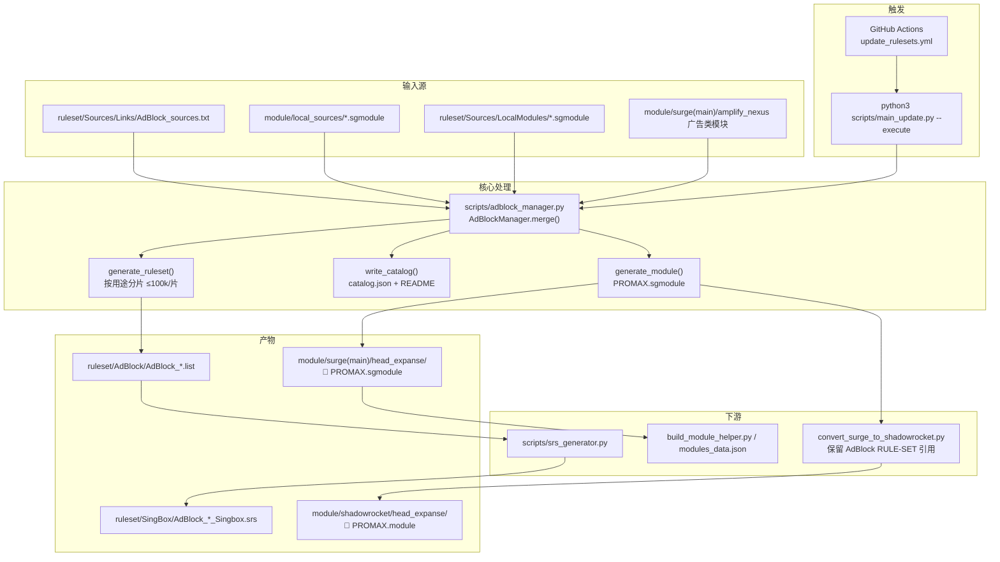

# 广告拦截（AdBlock）调用链

## 总览



## 用途分类（dedup 优先级自上而下）

| 键名 | 中文 | 典型来源 |
|------|------|----------|
| `Local` | 应用定制 | `LocalModules/`、`local_sources/` |
| `Advertising` | 通用广告 | blackmatrix7 Advertising、ACL4SSR BanAD |
| `Privacy` | 隐私追踪 | Privacy_All、tracking-protection |
| `Security` | 安全威胁 | Hijacking、skk reject、HTTPDNS |
| `AntiAD` | Anti-AD | anti-AD surge2 / discretion |
| `ThreatIntel_Ultimate` | 威胁情报·终极 | hagezi `ultimate.txt` |
| `ThreatIntel_TIF` | 威胁情报·TIF | hagezi `tif.medium.txt` |
| `ThreatIntel` | 威胁情报·补充 | 其它 hagezi / reject_phishing |
| `Other` | 其他补充 | 社区 sgmodule、未归类源 |

同一规则在多个源出现时，仅保留**优先级更高**分类中的一份。

## 分片策略

- 每个用途桶独立生成 `ruleset/AdBlock/AdBlock_{Category}.list`
- 单桶超过 **100,000** 条时拆为 `AdBlock_{Category}_01.list`、`_02.list` …
- 避免旧方案 50 万条/片（难维护）与孤儿分片（如 `Hagezi_3` 未引用）
- 重建后 `prune_stale_rulesets()` 删除不再生成的 `.list` / `.srs`

## 模块如何引用分片

**Surge PROMAX**（`head_expanse/🚫 … PROMAX … .sgmodule`）：

1. DNS 白名单 + `HTTPDNS_Hijack.list`
2. 按用途分组的 `RULE-SET` → `fastly.jsdelivr.net/.../ruleset/AdBlock/...`
3. skk_upstream：`reject-no-drop` / `reject-drop` / `BlockHttpDNS`
4. 复杂规则（URL-REGEX / PROCESS-NAME 等）内联在 `[Rule]`
5. `[URL Rewrite]` / `[Script]` / `[MITM]` 等非 Rule 段

**Shadowrocket**：`convert_surge_to_shadowrocket.py` 对 AdBlock 分片**保留 RULE-SET**，不展开为百万行内联规则。

## 索引与安装链接

每次 `merge()` 后自动更新：

- `ruleset/AdBlock/catalog.json` — 机器可读（分片 URL、规则数、模块安装链）
- `ruleset/AdBlock/README.md` — 人类可读表格

手动重建仅广告模块：

```bash
python3 scripts/adblock_manager.py --execute
python3 scripts/convert_surge_to_shadowrocket.py
cd scripts && python3 srs_generator.py   # 需本机 sing-box
```

## 与主流程关系

`scripts/main_update.py` 顺序：

1. `UpstreamSyncer` → skk / nexus / MetaCubeX  
2. `RulesetManager` → 非 AdBlock 业务规则集  
3. **`AdBlockManager.merge()`** → 本链路  
4. `smart_cleanup` → 跨规则集去重  
5. `convert_surge_to_shadowrocket` + `consolidate_modules`  
6. `SRSGenerator` → Sing-box `.srs`  
7. Git commit & push（`--execute` / CI）

## 用户安装（单一入口）

仅安装 **PROMAX** 模块即可，勿重复安装 `module/local_sources/` 下已合并的源模块：

- Surge: 见 `catalog.json` → `modules.surge_promax.install_url`
- Shadowrocket: 见 `modules.shadowrocket_promax.install_url`
